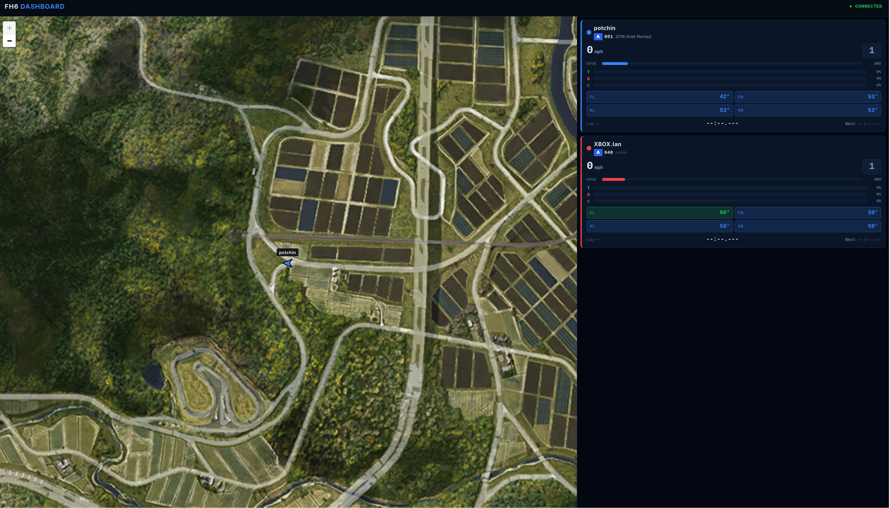

# fh6-web

Multi-user Forza Horizon 6 telemetry dashboard, accessible from any browser on your local network.

Receives UDP telemetry from one or more players simultaneously, identifies each by source IP, and streams live data to all connected browsers over WebSocket. No install required on the viewer — just open a URL.



## Features

- **Live map** — Leaflet map with the FH6 Japan tile set, showing all players as directional arrows with colour-coded driven traces
- **Per-player cards** — speed, gear, RPM bar, throttle/brake/clutch bars, tyre temps (with cold/optimal/hot colour coding), lap times and race position
- **Multi-player** — up to 8 players simultaneously, each assigned a distinct colour; players time out after 30 s of silence and show an OFFLINE overlay
- **Any browser** — pure HTML/CSS/JS frontend, no framework, no build step; works on desktop, phone, or tablet
- **Docker** — single container, no host dependencies

## Quick start

```bash
docker compose up -d
```

Then open `http://<host-ip>:8080` in any browser on your network.

## Forza Horizon 6 setup

In FH6 go to **Settings → HUD and Gameplay → DATA OUT** and set:

| Setting | Value |
|---|---|
| Data Out | On |
| Data Out IP Address | LAN IP of the machine running this container |
| Data Out IP Port | `20440` (or your custom `UDP_PORT`) |
| Data Out Packet Format | **Car Dash** |

Each player points their game at the same server IP. The server identifies players by their source IP address.

## Ports

| Port | Protocol | Purpose |
|---|---|---|
| `8080` | TCP | HTTP dashboard + WebSocket |
| `20440` | UDP | FH6 telemetry receive |

## Configuration

Set via environment variables (or the `environment:` block in `docker-compose.yml`):

| Variable | Default | Description |
|---|---|---|
| `UDP_PORT` | `20440` | UDP port to listen on for telemetry |

## Architecture

```
Xbox / PC running FH6
  │  UDP packets (323–339 bytes, little-endian binary)
  ▼
server.py  (FastAPI + asyncio)
  ├── asyncio DatagramProtocol  →  parses packets, keyed by source IP
  ├── AppState                  →  player registry, trace ring buffer (500 pts)
  ├── player_timeout_loop       →  evicts silent players after 30 s
  ├── /ws  WebSocket endpoint   →  fans out JSON to all browsers
  └── /    StaticFiles          →  serves static/index.html + map tiles

Browser (index.html)
  ├── Leaflet map  →  tile layer + per-player polyline + arrow marker
  └── Cards panel  →  one card per active player, updated ~20 Hz
```

### WebSocket message protocol

All messages are JSON with a `type` field.

**`state`** — sent once on WebSocket connect; full snapshot of all current players.
```json
{
  "type": "state",
  "players": {
    "192.168.1.10": {
      "id": "192.168.1.10",
      "label": "Player 1",
      "color": "#3b82f6",
      "active": true,
      "packet": { ...telemetry fields... }
    }
  }
}
```

**`update`** — sent on every parsed UDP packet (~20 Hz per player).
```json
{
  "type": "update",
  "player_id": "192.168.1.10",
  "packet": { ...telemetry fields... },
  "trace": [[-119.5, 3888.6], ...]
}
```

**`player_left`** — sent when a player times out.
```json
{ "type": "player_left", "player_id": "192.168.1.10" }
```

### Telemetry packet fields (camelCase in JSON)

Parsed from the 323–339 byte FH6 "Car Dash" UDP format. Key fields:

| Field | Type | Notes |
|---|---|---|
| `isRaceOn` | bool | Whether the game is active |
| `positionX`, `positionZ` | float | World coords used for map placement |
| `speedMs` | float | Speed in m/s (multiply by 2.23694 for mph) |
| `currentEngineRpm` / `engineMaxRpm` | float | For RPM bar |
| `throttle`, `brake`, `clutch` | 0–255 | Raw pedal values |
| `gear` | int | 0=R, 11=N, 1–10=drive |
| `yaw` | float | Radians; used for arrow heading |
| `tireTempFl/Fr/Rl/Rr` | float | °C (converted from °F in parser) |
| `lapNumber`, `currentLap`, `bestLap` | int/float | Lap tracking |
| `racePosition` | int | 0 when not in a race |

## Map tiles

The `static/maptiles/` directory contains the FH6 Japan map tiles in XYZ format at zoom levels 9–14. Tiles are served at `/maptiles/{z}/{y}/{x}.jpg`.

The world-to-pixel calibration constants are baked into `index.html`:

```js
// Two reference points: world (X, Z) → full-resolution pixel (X, Y)
CAL_A_WORLD = [-119.49154, 3888.595],  CAL_A_PIX = [2089486, 2087415]
CAL_B_WORLD = [-7104.7695, -1863.08],  CAL_B_PIX = [2086885, 2089556]
```

## Development

To iterate without rebuilding the image, copy changed files directly into the running container:

```bash
# Frontend changes (instant)
docker cp static/index.html fh6-web:/app/static/index.html

# Server changes (requires restart)
docker cp server.py fh6-web:/app/server.py
docker compose restart
```

To rebuild from scratch:

```bash
docker compose down
docker compose up -d --build
```

## File structure

```
fh6-web/
├── server.py            # FastAPI app: UDP parser, WebSocket broadcaster, static server
├── requirements.txt     # Python dependencies (fastapi, uvicorn, websockets)
├── Dockerfile           # python:3.12-slim + uv for fast installs
├── docker-compose.yml   # Single service, ports 8080/tcp + 20440/udp
├── AGENTS.md            # AI agent guidance
└── static/
    ├── index.html       # Entire frontend: Leaflet map + player cards
    └── maptiles/        # FH6 Japan XYZ tiles (z9–z14, ~60 MB)
        └── {z}/{y}/{x}.jpg
```

## Credits

Packet format and map calibration derived from [fh6-tel](https://github.com/TheBanHammer/fh6-tel) by BanHammer (MIT licence).
